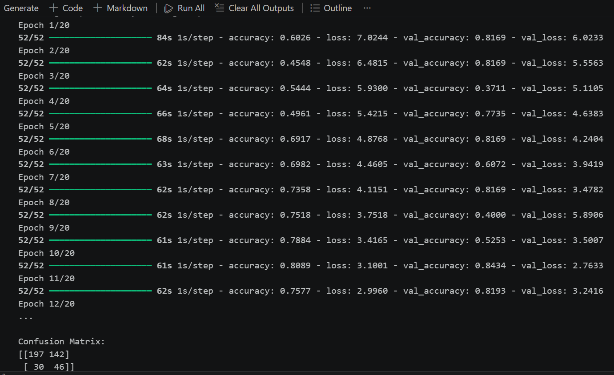
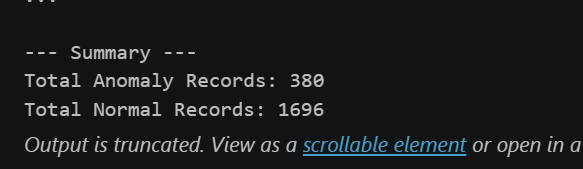
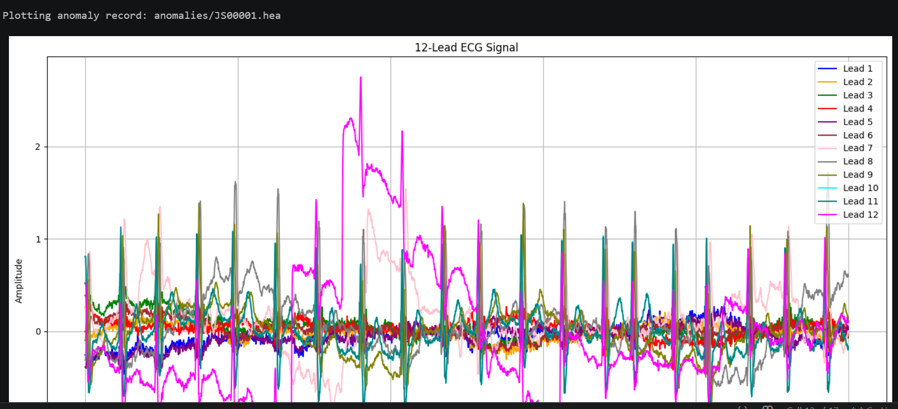

# 📊 ML Project – IIT Delhi (Winter Internship 2025)

## 📌 Overview

This project was developed as part of an **Advanced Machine Learning Internship at IIT Delhi (Winter 2025)**.
The objective of this project is to apply machine learning techniques to analyze data, perform preprocessing, and build predictive models to generate meaningful insights.

---

## ⚙️ Tech Stack

* Python
* NumPy
* Pandas
* Scikit-learn
* Matplotlib / Seaborn
* Jupyter Notebook

---

## 📂 Dataset

The dataset used in this project is large and cannot be hosted directly on GitHub.

👉 Download dataset from here:
https://drive.google.com/drive/folders/1XAr9LgEnjmii7vjM5PRVMFrQ7XslTVoa?usp=drive_link

---

## 🚀 Project Workflow

1. Data Collection
2. Data Cleaning & Preprocessing
3. Exploratory Data Analysis (EDA)
4. Feature Engineering
5. Model Training
6. Model Evaluation

---

## 📈 Results

* Machine learning model trained and evaluated on the dataset
* Achieved meaningful insights and predictions
* (👉 Add your accuracy / metrics here)

---

## ▶️ How to Run

1. Clone or download this repository
2. Download the dataset from the link above
3. Place the dataset inside the project folder
4. Open `model.ipynb` in Jupyter Notebook
5. Run all cells step-by-step

---

## 📸 Output / Screenshots

---

## 📁 Project Structure

project/
│── model.ipynb
│── README.md
│── report

---

## 👤 Author

* Hakima Banoo

---

## ⭐ Notes

* Dataset is hosted externally due to GitHub file size limitations
* This project is part of academic/internship work
* Intended for learning and demonstration purposes
